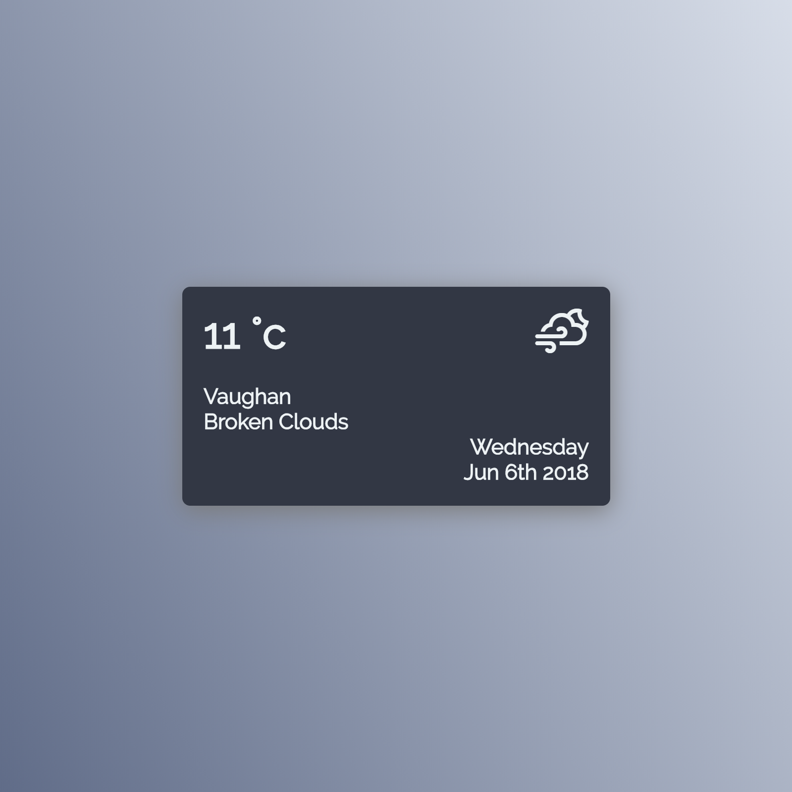

# Weather Please

A minimalistic widget to display real-time weather condition at the current location.

## Made with

- React
- Sass
- OpenWeatherMap API

## Setup

- `git clone git@github.com:leemun1/react-weather-app.git`
- `cd react-weather-app`
- `yarn install`
- `yarn start`
- visit [http://localhost:3000](http://localhost:3000)
